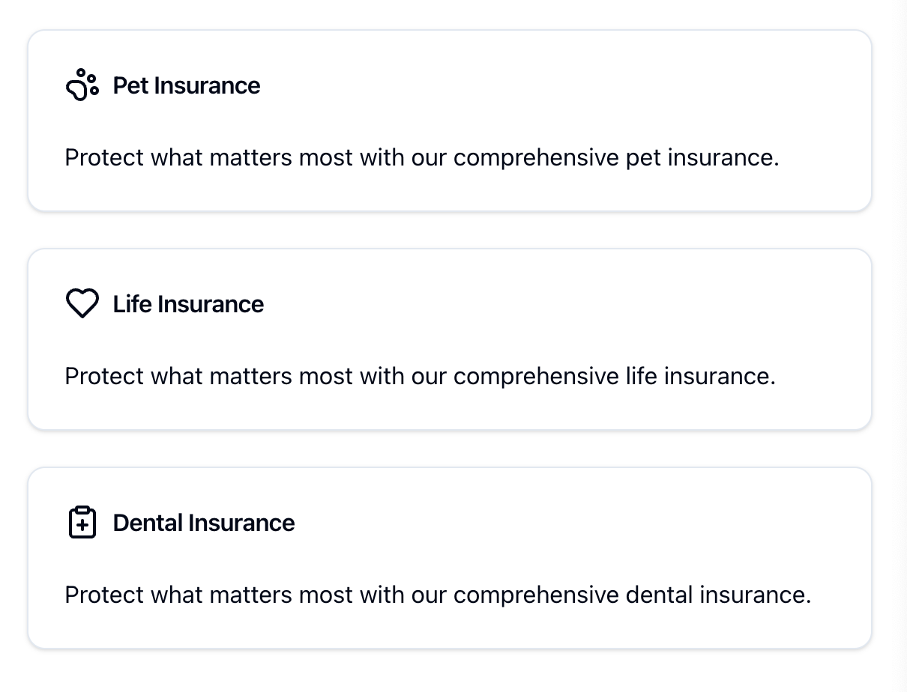
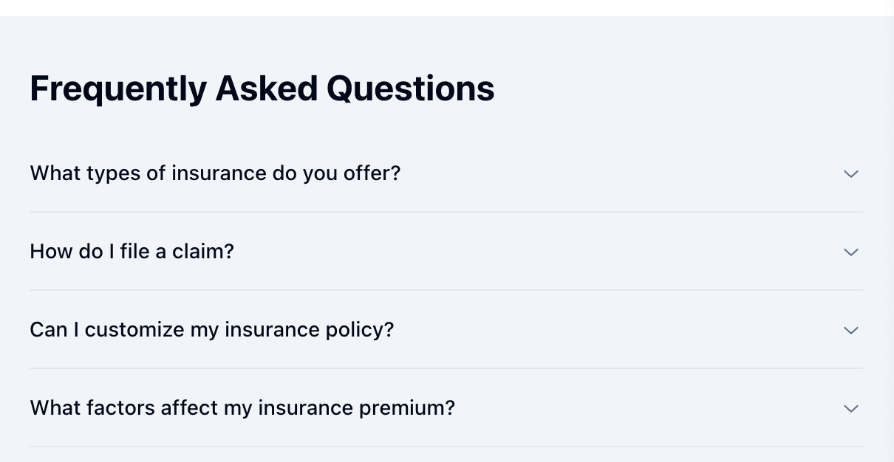

# Deploying the New Data Layer Object

This README provides a comprehensive guide for deploying a new `digitalData` object that initializes on page load and during user interactions on your website. Follow these steps to implement and test the `digitalData` structure effectively.

## Table of Contents

- [Initialization](#initialization)
- [Object Structure](#object-structure)
  - [Interaction Event](#interaction-event)
  - [Page Load Event](#page-load-event)
- [Type Definitions](#type-definitions)
- [Examples](#examples)
  - [Navigation Bar](#1-navigation-bar)
  - [Card](#2-card)
  - [Button (CTA)](#3-button-cta)
  - [Accordion](#4-accordion)
  - [Search Bar](#5-search-bar)
  - [Form Submission](#6-form-submission)
- [Notes](#notes)

## Initialization

To initialize the `digitalData` object on your webpage, use the following script:

```javascript
window.digitalData = window.digitalData || [];
```

## Object Structure

### Interaction Event

The `digitalData` object for an interaction event:

```javascript
digitalData.push({
  "interaction": {
    "eventType": "button",    // Example: "navbar", "buttonClick", "formSubmit"
    // ...additional properties
  },
  "pageInfo": {
    // Page information
  },
  "form": {
    // Form information
  },
  "user": {
    // User information
  },
  "event": "interaction"
});
```

### Page Load Event

The `digitalData` object for a page load event:

```javascript
digitalData.push({
  "pageInfo": {
    "pageName": "DataLayer Test Home",
    // ...additional page properties
  },
  "form": {
    // Form information if applicable
  },
  "user": {
    "email": "example@example.com",
    // ...additional user properties
  },
  "event": "pageLoad"
});
```

## Type Definitions

Define object types to avoid runtime issues:

```typescript
interface DigitalDataEntry {
  interaction: {
    eventType: string;
    // ...additional properties
  };
  pageInfo: {
    pageName: string;
    // ...additional properties
  };
  form: {
    formName: string;
    // ...additional properties
  };
  user: {
    email: string;
    // ...additional properties
  };
  event: string;
}
```

## Examples

### 1. Navigation Bar

**Payload Example:**

```javascript
{
  "interaction": {
    "eventType": "navigation",
    "clickText": "Insurance Products",
    // ...additional properties
  },
  "event": "interaction"
}
```


### 2. Card

**Payload Example:**

```javascript
{
  "interaction": {
    "eventType": "card",
    "clickText": "Pet Insurance",
    // ...additional properties
  },
  "event": "interaction"
}
```


### 3. Button (CTA)

**Payload Example:**

```javascript
{
  "interaction": {
    "eventType": "button",
    "clickText": "Get a Quote Now",
    // ...additional properties
  },
  "event": "interaction"
}
```


### 4. Accordion

**Payload Example:**

```javascript
{
  "interaction": {
    "eventType": "accordion",
    "clickText": "FAQ: How do I file a claim?",
    // ...additional properties
  },
  "event": "interaction"
}
```


### 5. Search Bar

**Payload Example:**

```javascript
{
  "interaction": {
    "eventType": "search",
    "searchTerm": "insurance",
    // ...additional properties
  },
  "event": "interaction"
}
```


### 6. Form Submission

**Payload Example:**

```javascript
{
  "interaction": {
    "eventType": "button",
    // ...additional properties
  },
  "form": {
    "formName": "life-insurance-form",
    // ...additional form properties
  },
  "event": "interaction"
}
```


## Notes

- **Consistency**: Ensure data is accurately and consistently formatted.
- **Placeholder Values**: Replace placeholder values with actual data.
